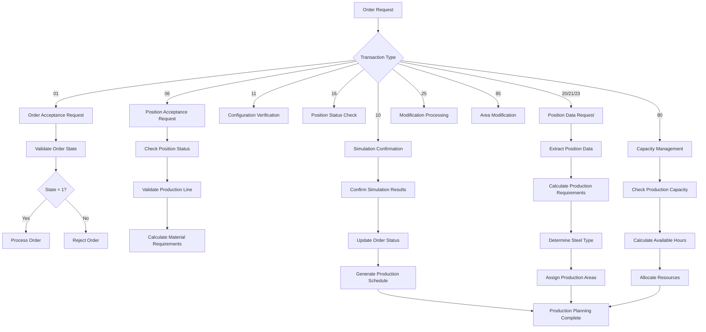

# Business Process Flow

## Order Processing and Production Planning Workflow

The SVCSIM01 system manages a comprehensive order-to-production workflow that handles order acceptance, production scheduling, and capacity management across multiple manufacturing facilities.

## Core Business Processes

### 1. Order Acceptance Workflow
The system processes incoming orders through a structured acceptance process:
- **Order Validation**: Verifies order completeness and customer information
- **State Management**: Tracks orders through states 1 (pending), 2 (accepted), 3 (confirmed), 4 (completed)
- **Line Assignment**: Determines appropriate production lines based on material specifications
- **Customer Verification**: Validates customer-specific requirements and delivery dates

### 2. Production Planning Process
Manufacturing schedules are created based on order requirements and facility capacity:
- **Area Assignment**: Allocates production to specific sub-areas based on material type and dimensions
- **Capacity Calculation**: Determines available production hours across different time periods
- **Resource Scheduling**: Balances workload across production lines and time slots
- **Date Management**: Establishes realistic delivery dates based on production capacity

### 3. Material Specification Process
The system handles detailed material requirements and specifications:
- **Steel Type Selection**: Determines appropriate steel grades based on product requirements
- **Dimension Validation**: Verifies diameter, thickness, and length specifications
- **Caliber Assignment**: Selects proper caliber settings for production equipment
- **Quality Requirements**: Manages surface treatment, testing, and certification needs

### 4. Capacity Management Process
Production capacity is monitored and allocated across facilities:
- **Hour Calculation**: Tracks available production hours per sub-area and time period
- **Load Balancing**: Distributes work to optimize facility utilization
- **Overflow Management**: Handles capacity constraints by rescheduling or reallocating work
- **Client-Specific Areas**: Manages dedicated production areas for specific customers

### 5. Quality Control Process
The system ensures product quality through validation and verification:
- **Specification Verification**: Confirms all material and dimensional requirements are met
- **Production Line Validation**: Ensures selected equipment can meet quality standards
- **Delivery Date Verification**: Validates that quality requirements can be met within timeframes
- **Documentation Management**: Tracks quality certifications and test requirements

## Business Decision Points

### Order State Transitions
- **State 1 → 2**: Order moves from pending to accepted after validation
- **State 2 → 3**: Accepted orders become confirmed after simulation approval
- **State 3 → 4**: Confirmed orders complete after production
- **Rejection Paths**: Orders rejected at any stage return to previous state or are cancelled

### Production Line Selection
- **Material-Based Assignment**: Different lines handle tubes, bars, curves, and special products
- **Facility Routing**: Orders routed to appropriate plants (DA, AR, RO, CV, SA, etc.)
- **Capacity-Based Decisions**: Work allocated based on available capacity and delivery requirements
- **Customer Priority**: Special handling for priority customers or rush orders

### Steel Type Determination
- **Automatic Calculation**: System calculates appropriate steel type based on specifications
- **Manual Override**: Operators can specify steel type when automatic calculation insufficient
- **Critical Steel Management**: Special handling for steel types with limited availability
- **Quality Matching**: Steel selection considers surface treatment and strength requirements

## Information Flow

### Order Entry to Production
1. **Order Receipt**: Customer orders enter system with complete specifications
2. **Validation Processing**: System verifies all requirements and constraints
3. **Production Assignment**: Orders allocated to appropriate facilities and time slots
4. **Schedule Generation**: Detailed production schedules created with delivery dates

### Material Specifications to Setup
1. **Specification Analysis**: System analyzes material requirements and dimensions
2. **Equipment Selection**: Appropriate production lines and caliber settings determined
3. **Setup Instructions**: Detailed setup parameters generated for production equipment
4. **Quality Parameters**: Quality control requirements established and documented

### Capacity Planning to Scheduling
1. **Capacity Assessment**: Available production hours calculated across all facilities
2. **Demand Analysis**: Order requirements analyzed against available capacity
3. **Resource Allocation**: Production capacity allocated to meet delivery commitments
4. **Schedule Optimization**: Production schedules optimized for efficiency and delivery performance