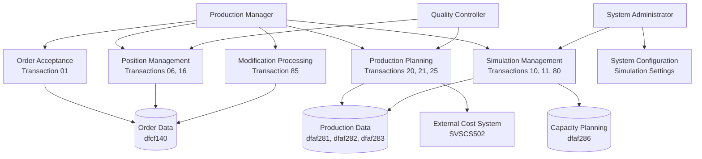

# Business Use Cases & Scenarios

## Overview

The SVCSIM01 system supports steel production planning and order management through simulation and acceptance workflows. The system enables production managers to evaluate capacity, accept orders, and plan production schedules across multiple manufacturing facilities.

## Primary Business Actors

- **Production Manager**: Plans production schedules and manages capacity allocation
- **Quality Controller**: Verifies order specifications and steel quality requirements
- **System Administrator**: Manages simulation settings and system configuration

## Core Business Use Cases

### 1. Order Acceptance Workflow (Transaction 01)
**Business Purpose**: Retrieve pending orders that require acceptance decisions

**Process Flow**:
- Production managers request lists of confirmations awaiting acceptance
- System filters orders by facility and production line
- Returns order details including customer information and specifications
- Supports pagination through large order volumes

**Business Value**: Enables systematic review and prioritization of incoming orders

### 2. Position Management (Transactions 06, 16)
**Business Purpose**: Manage individual production positions within orders

**Process Flow**:
- Retrieve positions requiring acceptance decisions (Transaction 06)
- Check current status of specific positions (Transaction 16)
- View position details including delivery dates, quantities, and specifications
- Track position progression through production states

**Business Value**: Provides granular control over production scheduling and resource allocation

### 3. Production Data Analysis (Transactions 20, 21, 25)
**Business Purpose**: Analyze production requirements and capacity utilization

**Process Flow**:
- Extract detailed position data including steel specifications
- Calculate production requirements across sub-areas
- Analyze capacity constraints and productivity metrics
- Generate reports for production planning decisions

**Business Value**: Supports data-driven production planning and resource optimization

### 4. Simulation Management (Transactions 10, 11, 80)
**Business Purpose**: Test production scenarios before committing resources

**Process Flow**:
- Accept simulation results and convert to actual production plans (Transaction 10)
- Verify completion of simulation processes (Transaction 11)
- Execute capacity planning simulations with constraint analysis (Transaction 80)

**Business Value**: Reduces production risks through scenario testing and validation

### 5. Modification Processing (Transaction 85)
**Business Purpose**: Handle changes to existing production orders

**Process Flow**:
- Process modifications to confirmed orders
- Recalculate capacity and scheduling impacts
- Update production plans to reflect changes

**Business Value**: Maintains production flexibility while preserving schedule integrity

## Business Scenarios

### Scenario 1: Daily Production Planning
1. Production manager reviews pending orders (Transaction 01)
2. Analyzes capacity requirements for selected orders (Transaction 20)
3. Runs simulation to test production feasibility (Transaction 80)
4. Accepts viable orders into production schedule (Transaction 10)

### Scenario 2: Order Modification Handling
1. Customer requests changes to existing order
2. System processes modification request (Transaction 85)
3. Production manager reviews impact on capacity and delivery dates
4. Accepts or rejects modification based on feasibility analysis

### Scenario 3: Quality Verification Process
1. Quality controller reviews steel specifications for positions (Transaction 06)
2. Verifies critical steel types and production requirements
3. Confirms positions meet quality standards before production
4. Tracks position status through quality checkpoints (Transaction 16)

## Business Rules and Constraints

### Capacity Management
- System enforces maximum capacity limits per production area
- Prevents over-allocation of resources beyond facility capabilities
- Calculates optimal production sequences based on equipment constraints

### Steel Quality Control
- Validates steel specifications against production capabilities
- Identifies critical steel types requiring special handling
- Ensures compatibility between steel grades and production equipment

### Delivery Date Management
- Maintains delivery commitments through scheduling optimization
- Adjusts production sequences to meet customer requirements
- Provides early warning for potential delivery delays

## Use Case Diagram

## Business Benefits

### Operational Efficiency
- Streamlines order acceptance and production planning processes
- Reduces manual effort through automated capacity calculations
- Enables rapid response to customer requirements and changes

### Risk Management
- Simulation capabilities prevent over-commitment of resources
- Early identification of capacity constraints and delivery risks
- Quality controls ensure production feasibility before commitment

### Customer Service
- Accurate delivery date commitments based on realistic capacity analysis
- Flexible handling of order modifications and special requirements
- Improved visibility into production status and progress

The system serves as the central hub for production decision-making, enabling steel manufacturers to balance customer demands with operational constraints while maintaining quality standards and delivery commitments.