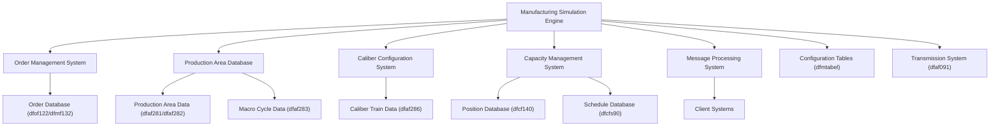
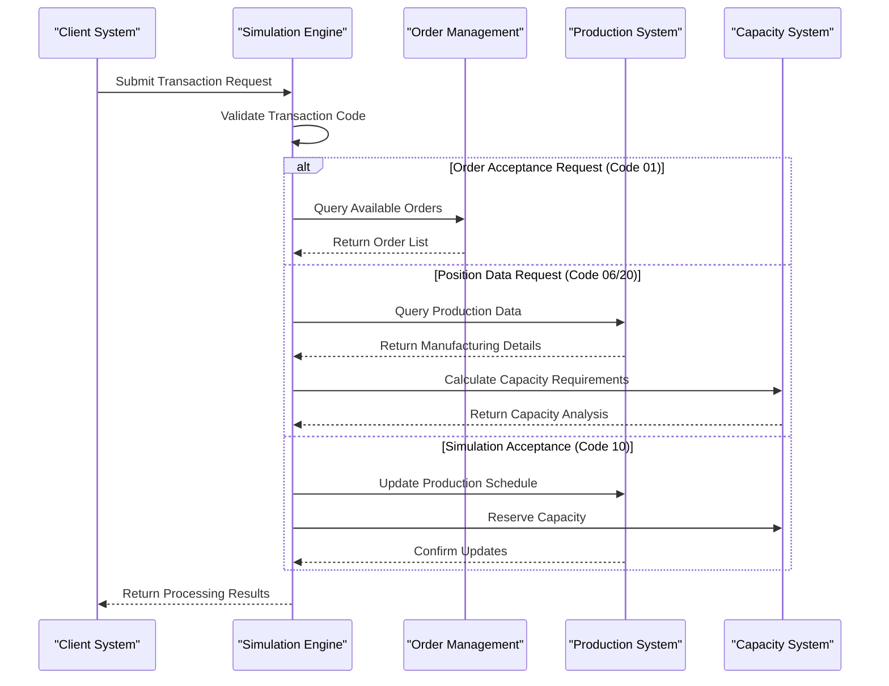
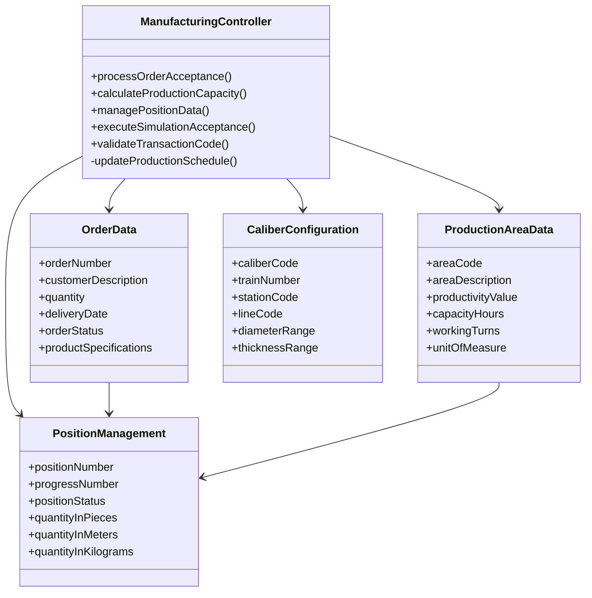
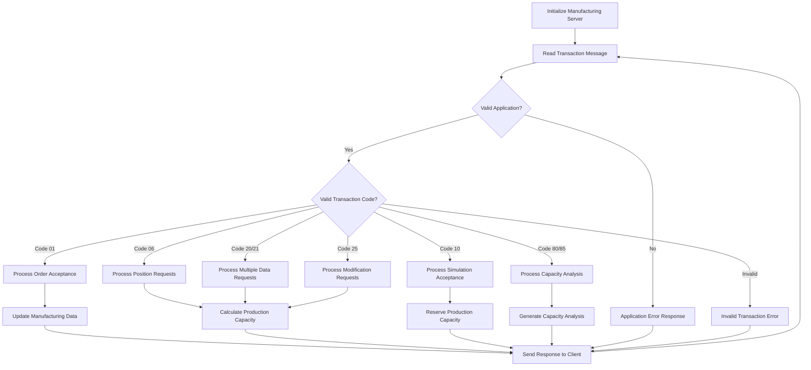

# UML Diagrams & System Architecture

## System Overview

The Manufacturing Simulation Engine (`svcsim01`) is a comprehensive COBOL-based system that manages order acceptance, production scheduling, and capacity planning across multiple manufacturing facilities. The system processes various transaction types to simulate production workflows and calculate resource requirements.

## Component Architecture

## Transaction Processing Flow

## Data Model

## Main Process Flow

## Integration Points

The Manufacturing Simulation Engine integrates with several external systems:

### External System Connections
- **Order Management Systems**: Interfaces with order databases (dfof122, dfmf132) for order processing
- **Production Planning Systems**: Connects to production area databases (dfaf281, dfaf282, dfaf283) for capacity planning
- **Configuration Management**: Accesses caliber and equipment configuration data (dfaf286)
- **Client Applications**: Processes requests from various manufacturing client systems
- **Transmission Systems**: Manages data transmission for remote facilities (dfaf091)

### Data Flow Architecture
- **Input Processing**: Receives transaction requests through message-based communication
- **Data Validation**: Validates transaction codes and application authorization
- **Business Logic Execution**: Processes manufacturing-specific calculations and simulations
- **Database Operations**: Performs read/write operations across multiple manufacturing databases
- **Response Generation**: Returns structured responses based on transaction type
- **Error Handling**: Comprehensive error management with detailed error codes and descriptions

### System Capabilities
- **Multi-facility Support**: Handles manufacturing operations across different stations and production lines
- **Real-time Processing**: Processes manufacturing requests in real-time with immediate responses
- **Capacity Management**: Calculates and manages production capacity across multiple time periods
- **Order Simulation**: Simulates order acceptance scenarios before actual commitment
- **Production Scheduling**: Updates production schedules based on accepted orders and capacity constraints