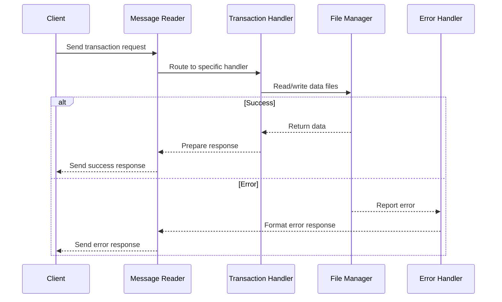
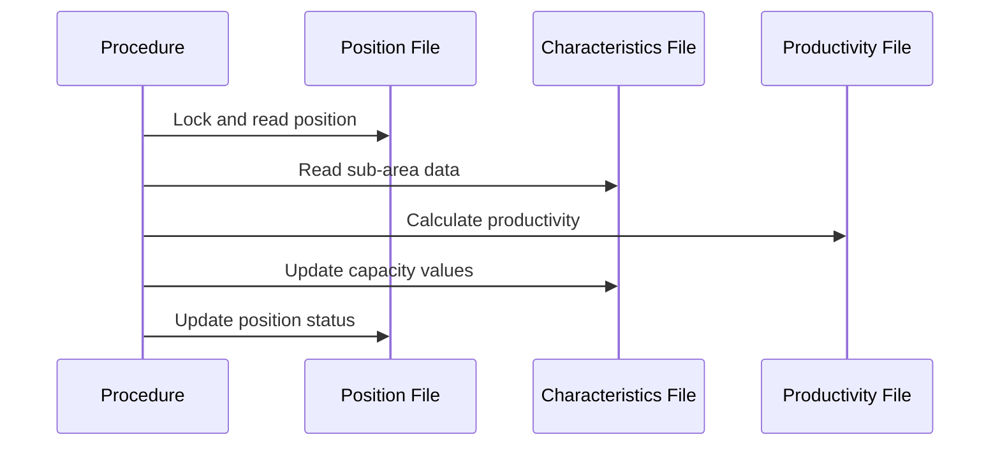
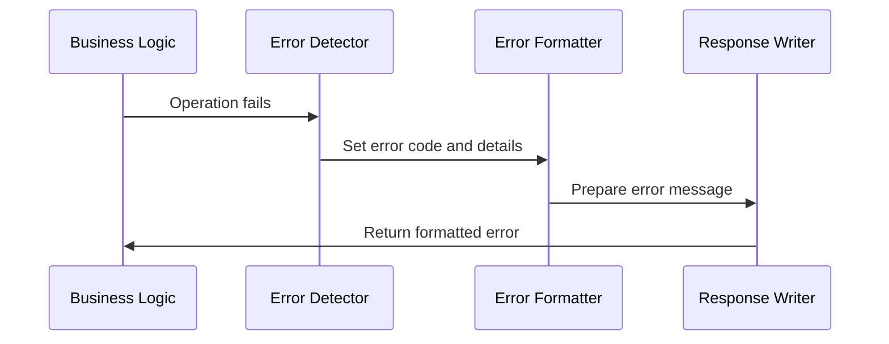

# Methods & Procedures Documentation

## Main Transaction Handlers

### Transaction Processing Methods

#### `trat-funz-01` - Request Orders to Accept (Transaction 1)
**Purpose**: Retrieves orders available for acceptance based on station and line criteria.

**Input Parameters**:
- `msv01-societa` - Company code
- `msv01-linea` - Production line
- `msv01-sta` - Station code
- `msv01-prec-sta` - Previous station (optional)
- `msv01-prec-linea` - Previous line (optional)

**Output**: Populates `recsv001` with order details including confirmation numbers, modifications, and customer descriptions.

**Key Logic**:
```cobol
move rq-soc                      to f140-soc-alt
move "1"                         to f140-stato-alt
move msv01-linea                 to f140-lin-alt
move msv01-sta                   to f140-stab-alt
```

#### `trat-funz-06` - Request Positions to Accept (Transaction 6)
**Purpose**: Retrieves position details for a specific order confirmation.

**Input Parameters**:
- `msv06-conf` - Confirmation number
- `msv06-mod` - Modification number
- `msv06-pos` - Position number

**Output**: Returns position data including quantities, delivery dates, and production line assignments.

**Business Logic**: Validates position states and filters out positions with state "4" (completed).

#### `trat-funz-10` - Simulation Acceptance OK (Transaction 10)
**Purpose**: Processes acceptance of simulation results and updates production schedules.

**Input Parameters**:
- `msv10-num-conf` - Confirmation number
- `msv10-num-pos` - Position number
- `msv10-cons-aa/mm/gg` - Delivery date components
- `msv10-s-area` - Sub-area array (27 elements)

**Key Operations**:
1. Validates position state must be "1"
2. Calculates production hours for each sub-area
3. Updates F140 record with new status ("2" or "3")
4. Writes to F091 transmission file for local tandems

#### `trat-funz-20` - Position Data and Productivity Request (Transaction 20)
**Purpose**: Retrieves detailed position data including productivity calculations and sub-area information.

**Input Parameters**:
- `msv20-num-conf` - Confirmation number
- `msv20-num-pos` - Position number
- `msv20-macrociclo` - Macro cycle (optional override)

**Output**: Comprehensive position data including caliber, train, steel type, and productivity values for up to 27 sub-areas.

#### `trat-funz-80` - Simulation Processing (Transaction 80)
**Purpose**: Performs production simulation with three different scheduling strategies.

**Simulation Strategies**:
1. **Backward scheduling**: Attempts to schedule from delivery date backwards
2. **Forward scheduling**: Schedules from current date forward if backward fails
3. **Last month placement**: Places in final available month if other methods fail

**Output**: Returns scheduling results with execution indicator (`rtab-ind-esec`).

## File I/O Operations

### F140 Position File Operations

#### `read-f140-lock`
**Purpose**: Reads F140 record with exclusive lock for updates.
```cobol
read dfcf140 with lock
```

#### `start-f140-gen-prec`
**Purpose**: Positions F140 file for generic key search with precedence handling.
```cobol
start dfcf140 key is = f140-chiave-alt
      after position f140-chiave, generic
```

#### `rewrite-f140`
**Purpose**: Updates F140 record and releases lock.
```cobol
rewrite drcf140 with unlock
```

### F282 Characteristics File Operations

#### `read-f282-lock`
**Purpose**: Reads sub-area characteristics with lock for capacity updates.

#### `imposta-valori-281-282`
**Purpose**: Sets dimension values and productivity parameters for sub-area calculations.

### F286 Caliber Train File Operations

#### `cerca-calaltri`
**Purpose**: Searches for alternative caliber and train combinations based on dimensions.

**Input**: Diameter, thickness, and dimension type from position
**Output**: Sets `com-calibro` and `com-treno` variables

## Business Logic Procedures

### Production Calculations

#### `calcola-pz-mt` - Calculate Pieces and Meters
**Purpose**: Computes piece count and meter quantities based on product specifications.

**Logic Flow**:
1. Initializes calculation variables
2. Calculates pieces if zero using `calcola-pezzi`
3. Calculates meters if zero using `calcola-metri`

#### `calcola-ll-lamftm` - Calculate FTM Rolling Length
**Purpose**: Determines rolling length for FTM (Finishing and Threading Mill) operations.

**Key Calculations**:
```cobol
compute peso-carica = (((f140-diam-sta - f140-spes-sta) * f140-spes-sta)
                      * 0,0246615) * (llmedia / 1000)
```

#### `rout-calc-ore-282` - Calculate Hours for Area 282
**Purpose**: Computes production hours required for each sub-area.

**Parameters**:
- `msv10-ore(ind)` - Required hours for sub-area
- `msv10-kg-tot` - Total weight
- `f140-qta-in-kg` - Position weight

**Calculation**:
```cobol
compute comodo-coef-ore rounded = msv10-ore (ind) / msv10-kg-tot
compute delta-ore rounded = comodo-coef-ore * f140-qta-in-kg
```

### Steel and Caliber Research

#### `ric-acc-da-ar-cv` - Steel Research for DA/AR/CV
**Purpose**: Determines appropriate steel grade for different production facilities.

**Facility Handling**:
- **CV**: Component facility processing
- **AR**: Reinforcement facility processing  
- **DA**: Various line types (FAS, FTM, ACC)

#### `cerca-acc-dalm` - Search Steel Alternatives
**Purpose**: Calls external steel calculation routine to determine optimal steel grade.

**External Call**:
```cobol
call "rcanor1" in cobacc using lnk-a-acciaio1 lk-lotto
```

## Error Handling Procedures

### Standard Error Handlers

#### `err-4` - Order/Modification Not Found Error
**Purpose**: Handles missing order or modification records.
```cobol
move "1" to sw-err
move 4 to ind-err
move "er" to tipo-reply
```

#### `err-5` - Position State Error
**Purpose**: Reports invalid position state (not equal to expected value).

#### `err-12` - Physical File Error
**Purpose**: Handles file system errors during read/write operations.

#### `err-32` - Steel Calculation Error
**Purpose**: Reports failure in steel grade calculation process.

### Specialized Error Procedures

#### `err-files`
**Purpose**: Generic file error handler that sets error indicators and prepares error response.

#### `fai-msg-err`
**Purpose**: Formats error messages with file status and system error codes.
```cobol
move 992 to sr-reply-code
move file-in-error to rem3-coderr
move file-err-buff to rem3-tipo-err
```

## Data Processing Procedures

### Productivity and Costing

#### `produttivita-costi` - Productivity Costs Processing
**Purpose**: Interfaces with external costing system to retrieve productivity values.

**Supported Facilities**:
- SA (Sabbio)
- AR (Reinforcement)
- FTM, FAP, ACC lines

**External Interface**: Uses PATHSEND to communicate with SVSCS502 server class.

#### `imposta-valdime-281` - Set Dimension Values for 281
**Purpose**: Maps product dimensions to sub-area calculation parameters.

**Dimension Types Handled**:
1. Tubes (`imp-tubi`)
2. Bars (`imp-barre`) 
3. Poles (`imp-pali`)
4. Cylinders (`imp-bombole`)
5. Hydraulic cylinders (`imp-cilindri`)
6. Curves (`imp-curve`)
7. Special products (`imp-speciali`)
8. Accessories (`imp-accessori`)

### Date and Time Processing

#### `imposta-sett` - Set Week Values
**Purpose**: Calculates ISO week numbers for delivery dates.

**External Call**:
```cobol
move 19 to g0data-funz  // ISO week calculation
perform call-g0data
```

#### `ver-data-cons-acc` - Verify Acceptance Delivery Date
**Purpose**: Validates and adjusts delivery dates for acceptance processing.

**Validation Rules**:
- Checks for base confirmation vs. modification
- Verifies date consistency
- Handles special cases for different facility types

## Sequence Diagrams

### Transaction Processing Flow


### File Access Pattern


### Error Handling Flow
