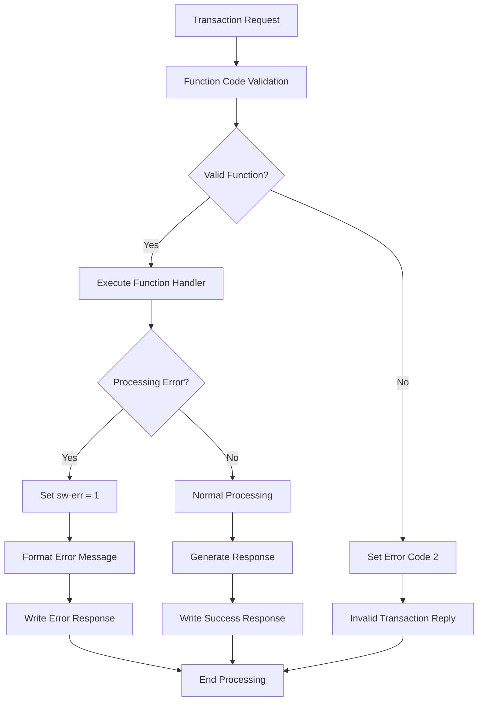

# Error Handling & Message Processing Documentation

## Overview

The COBOL program `svcsim01` implements a comprehensive error handling and message processing system that manages transaction processing, error detection, and response generation for manufacturing simulation operations.

## Error Table System (tabella-err)

### Error Message Structure
The system maintains a centralized error table containing 38 predefined error messages:

```cobol
01 tabella-err.
   02 filler pic x(64) value "01svcsim01 MACRO/S-AREA/INS-DIM NON PER STA-LINEA"
   02 filler pic x(64) value "02svcsim01 FUNZIONE ERRATA"
   ...
   02 filler pic x(64) value "38svcsim01 ERR. data acc. da reimpostare = 0"
```

### Error Table Components
- **38 error entries** (err-01 through err-38) with structured format
- **Redefines structure** (`taberr`) with `elem-err` occurring 38 times
- **Field structures** for different error data types:
  - `tip-err`: Error description (49 characters)
  - `val-12`: General value field (13 characters)
  - `val-8`/`pos-8`: 8-character value and 5-digit position
  - `val-r5`, `val-r3`, `val-r6`: Various redefines for different data formats
  - `val-diam6`: Diameter values (6+6 characters)
  - `val-rconf`: Configuration/modification/position values
  - `val-11`: 11-character composite field

## Error Handling Routines

### Specific Error Handlers
The system implements dedicated error handling procedures:

```cobol
err-4.     - Record not found in order/modification files
err-5.     - Commission/position in wrong state
err-7.     - Commission/position non-existent
err-12.    - Physical error on F140 file
err-32.    - Steel code not calculated
err-33.    - Read error for ROM F122/F132 files
```

### System Error Handlers
- `err-sistema`: System-level error processing
- `err-files`: File operation error handling
- `err-comune`: Common error processing
- `fai-msg-err`: Error message formatting routine
- `err-send-info`: Pathsend communication error handling

### File-Specific Error Handling
The declaratives section provides error handling for each file:
- Individual file error handlers for dfaf281, dfaf282, dfaf283, etc.
- `com-declarative` for general file error processing
- File status checking with `file-stat`, `no-error`, `end-of-file` conditions

## Message Processing Architecture

### Input Message Structure
```cobol
01 com-mscpc001.
   copy com-testa-rq of "$system.azutil.copylib"
   copy mscsv001 of "$data1.cortino1.msglib"
   copy mscsv006 of "$data1.cortino1.msglib"
   copy mscsv010 of "$data1.cortino1.msglib"
   copy mscsv020 of "$data1.cortino1.msglib"
   copy mscsv011 of "$data1.cortino1.msglib"
```

### Output Message Structure
```cobol
01 com-recpc001.
   copy com-testa-sr of "$system.azutil.copylib"
   copy recsv001 of "$data1.cortino1.msglib"
   copy recsv006 of "$data1.cortino1.msglib"
   copy recsv020 of "$data1.cortino1.msglib"
   copy recsv011 of "$data1.cortino1.msglib"
```

### Transaction Processing Flow
The `elab-trans` procedure routes messages based on function codes:

```cobol
if rq-funz-code = 01 perform trat-funz-01 thru end-trat-funz-01
if rq-funz-code = 06 perform trat-funz-06 thru end-trat-funz-06
if rq-funz-code = 10 perform trat-funz-10 thru end-trat-funz-10
if rq-funz-code = 11 perform trat-funz-11 thru end-trat-funz-11
if rq-funz-code = 16 perform trat-funz-16 thru end-trat-funz-16
if rq-funz-code = 20 perform trat-funz-20 thru end-trat-funz-20
if rq-funz-code = 21 perform trat-funz-21 thru end-trat-funz-21
if rq-funz-code = 25 perform trat-funz-25 thru end-trat-funz-25
if rq-funz-code = 80 perform trat-funz-80 thru end-trat-funz-80
if rq-funz-code = 85 perform trat-funz-85 thru end-trat-funz-85
```

## Reply Code Management

### Response Generation
The system uses `sr-reply-code` to indicate processing status:
- **0**: Successful processing
- **99**: End-of-file condition
- **992**: System error
- **802**: Specific business logic errors

### Response Writing Logic
```cobol
scrivi-risposta.
if tipo-reply = "er" or "ER" or "10"
   move des-err (ind-err) to rem3-tipo-err
   write rem00003

if tipo-reply = "01" write recsv001
if tipo-reply = "06" write recsv006
if tipo-reply = "20" write recsv020
if tipo-reply = "80" write rscsvtab
if tipo-reply = "85" write rscsvtab
```

## Pathsend Communication Error Handling

### Communication Variables
```cobol
01 pathsend-error           pic s9(4) comp
01 file-system-error        pic s9(4) comp
01 message-buffer           pic x(2020)
```

### Error Processing
The `esegui-pathsend` procedure handles server communication:
```cobol
enter tal "SERVERCLASS_SEND_INFO_" using pathsend-error,
                                         file-system-error
if (file-system-error not = zeros) or (pathsend-error not = zeros)
   perform err-send-info
```

## Error Processing Flow



## Specific Error Scenarios

### Record Not Found Handling
- **err-4**: Order/modification record not found in F122/F132
- **err-7**: Commission/position non-existent
- **err-33**: ROM record not found for T-D-0 processing

### Capacity and Validation Errors
- **err-31**: Hours overflow (> 999) in sub-area processing
- **err-38**: Acceptance date reset error (reimpostare = 0)
- **err-27**: Discharged kg < total kg supplied

### File I/O Error Processing
All file operations include error checking with automatic unlock operations:
```cobol
if not no-error
   perform err-12 thru end-err-12
   unlockrecord [filename]
```

## Message Buffer Management

The system uses a 2020-character message buffer for pathsend communications:
```cobol
01 message-buffer pic x(2020)
01 request-length pic s9(4) comp
01 maximum-reply-length pic s9(4) comp
01 actual-reply-length pic s9(4) comp
```

This comprehensive error handling system ensures robust transaction processing with detailed error reporting and appropriate response generation for all operational scenarios.